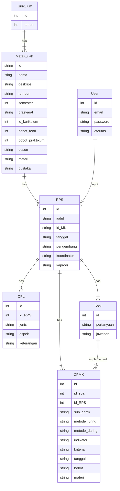
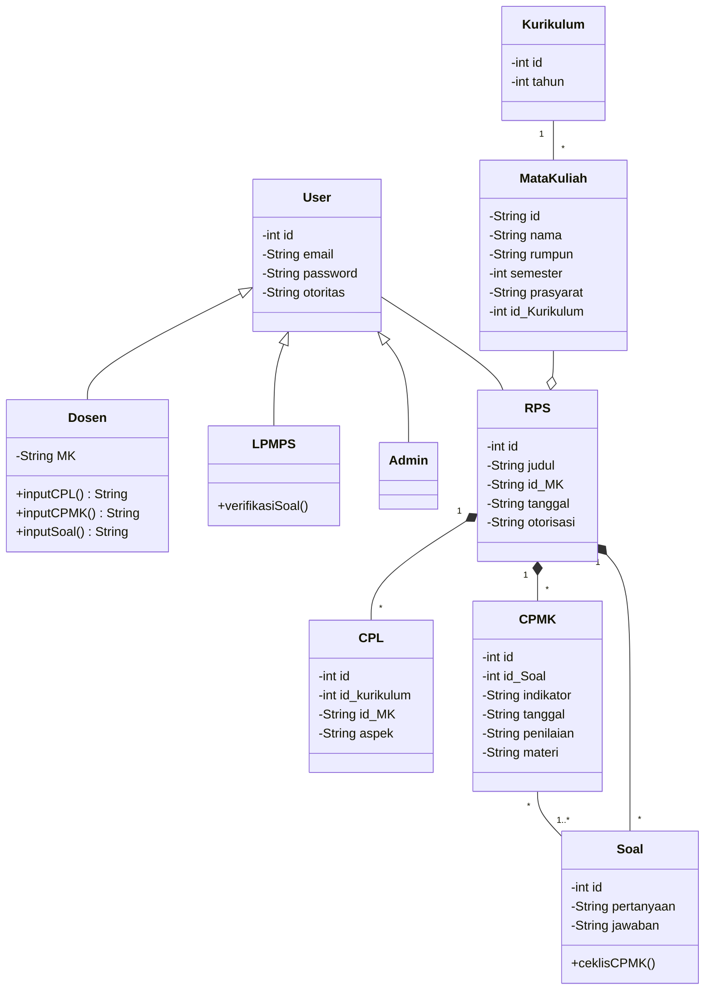

#ERD

```mermaid
erDiagram
          Kurikulum ||--|{ MataKuliah : has
          MataKuliah ||--|{ RPS : has
          RPS ||--|{ CPL : has
          RPS ||--|{ CPMK : has
          RPS ||--|{ Soal : has
          Soal ||--|{ CPMK : implemented
          User ||--|{ RPS : input 

          User {
            int id
            string email
            string password
            string otoritas 
          }
          Kurikulum {
            int id
            int tahun
          }
          MataKuliah {
            string id
            sting nama
            string deskripsi
            string rumpun
            int semester
            string prasyarat
            int id_kurikulum
            int bobot_teori
            int bobot_praktikum
            string dosen
            string materi
            string pustaka
          }
          RPS {
            int id
            string judul
            string id_MK
            string tanggal
            string pengembang
            string koordinator
            string kaprodi
          }
          CPL {
            int id
            int id_RPS
            string jenis
            string aspek
            string keterangan
          }
          CPMK {
            int id
            int id_soal
            int id_RPS
            string sub_cpmk
            string metode_luring
            string metode_daring
            string indikator
            string kriteria
            string tanggal
            string bobot
            string materi
          }
          Soal {
            int id
            string pertanyaan
            string jawaban
          }
```

#Class Diagram

```mermaid
classDiagram
      RPS "1" *-- "*" CPL
      RPS "1" *-- "*" CPMK
      RPS "1" *-- "*" Soal
      User <|-- Dosen
      User <|-- LPMPS
      User <|-- Admin
      User -- RPS
      CPMK "*" -- "1..*" Soal
      Kurikulum "1" -- "*" MataKuliah
      MataKuliah --o RPS
      class RPS{
          -int id
          -String judul
          -String id_MK
          -String tanggal
          -String otorisasi
      }
      class CPL{
          -int id
          -int id_kurikulum
          -String id_MK
          -String aspek
      }
      class CPMK{
          -int id
          -int id_Soal
          -String indikator
          -String tanggal
          -String penilaian
          -String materi
      }
      class User{
          -int id
          -String email
          -String password
          -String otoritas
      }
      class Dosen{
          -String MK
          +inputCPL() String
          +inputCPMK() String
          +inputSoal() String
      }
      class LPMPS{
          +verifikasiSoal()
      }
      class Kurikulum{
          -int id
          -int tahun
      }
      class MataKuliah{
          -String id
          -String nama
          -String rumpun
          -int semester
          -String prasyarat
          -int id_Kurikulum
      }
      class Soal{
          -int id
          -String pertanyaan
          -String jawaban
          +ceklisCPMK()
      }
```
