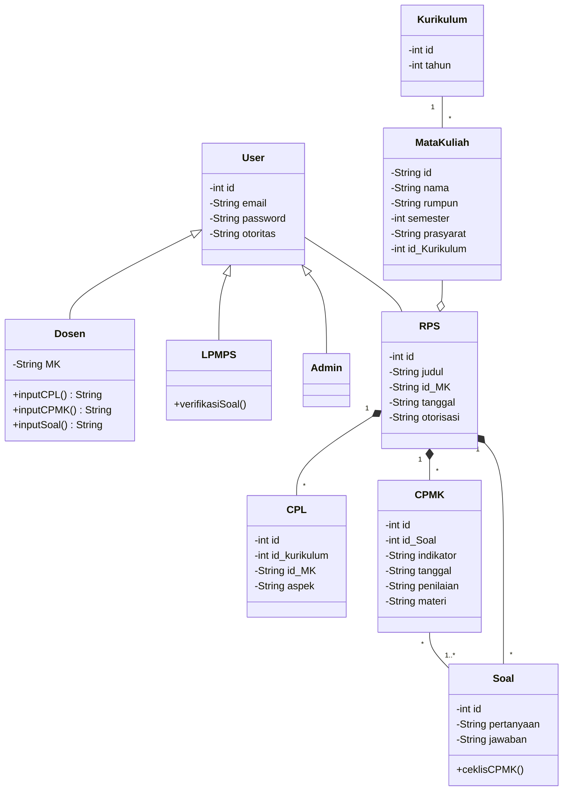

```mermaid
classDiagram
      RPS "1" *-- "*" CPL
      RPS "1" *-- "*" CPMK
      RPS "1" *-- "*" Soal
      User <|-- Dosen
      User <|-- LPMPS
      User <|-- Admin
      User -- RPS
      CPMK "*" -- "1..*" Soal
      Kurikulum "1" -- "*" MataKuliah
      MataKuliah --o RPS
      class RPS{
          -int id
          -String judul
          -String id_MK
          -String tanggal
          -String otorisasi
      }
      class CPL{
          -int id
          -int id_kurikulum
          -String id_MK
          -String aspek
      }
      class CPMK{
          -int id
          -int id_Soal
          -String indikator
          -String tanggal
          -String penilaian
          -String materi
      }
      class User{
          -int id
          -String email
          -String password
          -String otoritas
      }
      class Dosen{
          -String MK
          +inputCPL() String
          +inputCPMK() String
          +inputSoal() String
      }
      class LPMPS{
          +verifikasiSoal()
      }
      class Kurikulum{
          -int id
          -int tahun
      }
      class MataKuliah{
          -String id
          -String nama
          -String rumpun
          -int semester
          -String prasyarat
          -int id_Kurikulum
      }
      class Soal{
          -int id
          -String pertanyaan
          -String jawaban
          +ceklisCPMK()
      }
```