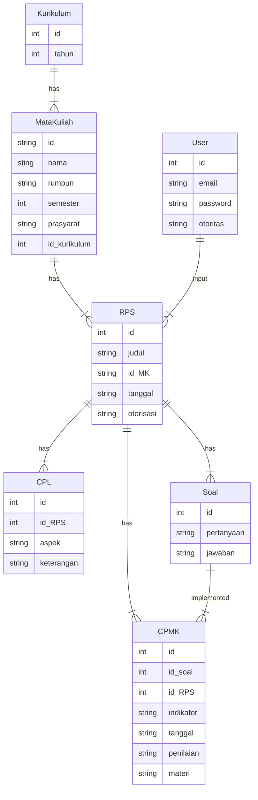

## SMMP

#ERD

```mermaid
erDiagram
          Kurikulum ||--|{ MataKuliah : has
          MataKuliah ||--|{ RPS : has
          RPS ||--|{ CPL : has
          RPS ||--|{ CPMK : has
          RPS ||--|{ Soal : has
          Soal ||--|{ CPMK : implemented
          User ||--|{ RPS : input 

          User {
            int id
            string email
            string password
            string otoritas 
          }
          Kurikulum {
            int id
            int tahun
          }
          MataKuliah {
            string id
            sting nama
            string rumpun
            int semester
            string prasyarat
            int id_kurikulum
          }
          RPS {
            int id
            string judul
            string id_MK
            string tanggal
            string otorisasi
          }
          CPL {
            int id
            int id_RPS
            string aspek
            string keterangan
          }
          CPMK {
            int id
            int id_soal
            int id_RPS
            string indikator
            string tanggal
            string penilaian
            string materi
          }
          Soal {
            int id
            string pertanyaan
            string jawaban
          }
```
