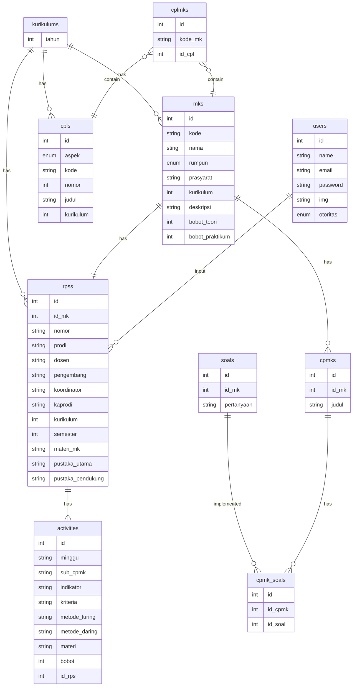

#ERD

```mermaid
erDiagram
          kurikulums ||--o{ mks : has
          kurikulums ||--o{ cpls : has
          kurikulums ||--o{ rpss : has
          cplmks }o--|| mks : contain
          cplmks }o--|| cpls : contain
          mks ||--|| rpss : has
          mks ||--o{ cpmks : has
          soals ||--o{ cpmk_soals : implemented
          cpmks ||--o{ cpmk_soals : has
          users ||--o{ rpss : input
          rpss ||--|{ activities : has

          users {
            int id
            string name
            string email
            string password
            string img
            enum otoritas 
          }
          kurikulums {
            int tahun
          }
          mks {
            int id
            string kode
            sting nama
            enum rumpun
            string prasyarat
            int kurikulum
            string deskripsi
            int bobot_teori
            int bobot_praktikum
          }
          rpss {
            int id
            int id_mk
            string nomor
            string prodi
            string dosen
            string pengembang
            string koordinator
            string kaprodi
            int kurikulum
            int semester
            string materi_mk
            string pustaka_utama
            string pustaka_pendukung
          }
          activities {
            int id
            string minggu
            string sub_cpmk
            string indikator
            string kriteria
            string metode_luring
            string metode_daring
            string materi
            int bobot
            int id_rps
          }
          cpls {
            int id
            enum aspek
            string kode
            int nomor
            string judul
            int kurikulum
          }
          cplmks {
            int id
            string kode_mk
            int id_cpl
          }
          cpmks {
            int id
            int id_mk
            string judul
          }
          soals {
            int id
            int id_mk
            string pertanyaan
          }
          cpmk_soals {
            int id
            int id_cpmk
            int id_soal
          }
```
